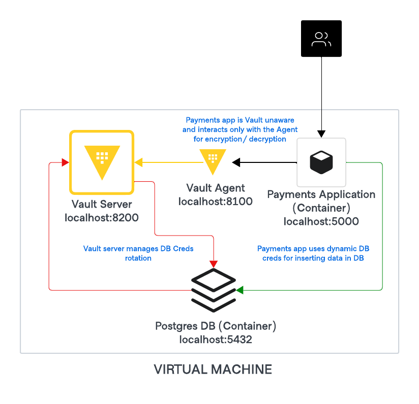

# HashiCups with Vault Integration

This repository contains shell scripts for deploying HashiCups with HashiCorp Vault integration on Ubuntu and RHEL operating systems.

## Architecture Overview

The deployment consists of:

- **HashiCups**: A demo application running in Docker containers with a web UI
- **HashiCorp Vault**: Running as a supervised process via supervisorctl
- **Vault Agent**: Acts as a cache and API proxy for the HashiCups application to securely interact with Vault

## Architecture Diagram



*Figure 1: High-level architecture diagram showing HashiCups, Vault, and Vault Agent integration*

## Prerequisites

- A new virtual machine with Ubuntu or RHEL OS
- Sufficient permissions to execute scripts and install packages
- Internet connectivity for downloading dependencies

## Deployment Instructions

### 1. Set Up License File

First, create and place the license file in the home directory of your OS user:

```bash
# For Ubuntu on AWS
/home/ubuntu/license.hclic

# For RHEL or Ubuntu on IBM Cloud
/home/linux1/license.hclic
```

Set appropriate permissions on the license file:

```bash
chmod 644 /home/$(whoami)/license.hclic
```

### 2. Create and Run setup script

Choose the appropriate script for your operating system (Ubuntu or RHEL) from the repository, create it on your VM, and make it executable:

```bash
# Download the script
curl -o setup.sh https://raw.githubusercontent.com/shriram2712/hashicups-vault/main/setup-vault-[ubuntu|redhat].sh

# Make it executable
chmod +x setup.sh

# Run the script
sudo ./setup.sh
```

## Setup Script Overview

The setup scripts perform the following operations:

1. **System preparation**:
   * Update system packages
   * Install dependencies (Docker, supervisord, curl, jq, etc.)
   * Setup Postgres Containers and setup the user for Vault DB Secrets engine
2. **HashiCorp Vault installation**:
   * Download and install Vault
   * Configure Vault server
   * Set up supervisord to manage Vault process
   * Initialize and unseal Vault
   * Setup the Vault Transit, Transform and DB Secrets engine
3. **Vault Agent configuration**:
   * Install Vault Agent
   * Configure it as a cache and API proxy
   * Set up necessary authentication methods
4. **HashiCups deployment**:
   * Pull and start HashiCups Docker containers
   * Configure HashiCups to communicate with Vault via Vault Agent

## Accessing the Application

Once deployment is complete:
* **HashiCups UI**: http://[VM-IP]:8080
* **Vault UI**: http://[VM-IP]:8200

### Important: Firewall Configuration

You must configure your firewall to expose ports 8200 and 5000 externally to access the user interfaces:
* **Port 8200**: Required for accessing the Vault UI
* **Port 5000**: Required for accessing parts of the HashiCups application

Depending on your environment, you may need to:
* Configure security groups (AWS/cloud)
* Update iptables rules (Linux)
* Modify network ACLs

Example for iptables:

```bash
sudo iptables -A INPUT -p tcp --dport 8200 -j ACCEPT
sudo iptables -A INPUT -p tcp --dport 5000 -j ACCEPT
```

## Troubleshooting

If you encounter issues during setup:
1. Check logs with `docker logs [container_id]` for HashiCups issues
2. Check Vault server logs with `sudo supervisorctl status vault-enterprise` and `journalctl -fu vault-enterprise`
3. Check Vault agent logs with `sudo supervisorctl status vault-agent` and `journalctl -fu vault-agent`
4. Ensure the license file is properly formatted and has correct permissions
5. Verify network connectivity between components

## Contributing

Contributions are welcome! Please feel free to submit a Pull Request.

## License

This project uses HashiCorp Vault which requires a license for some features. Ensure you have the proper licensing before deployment.